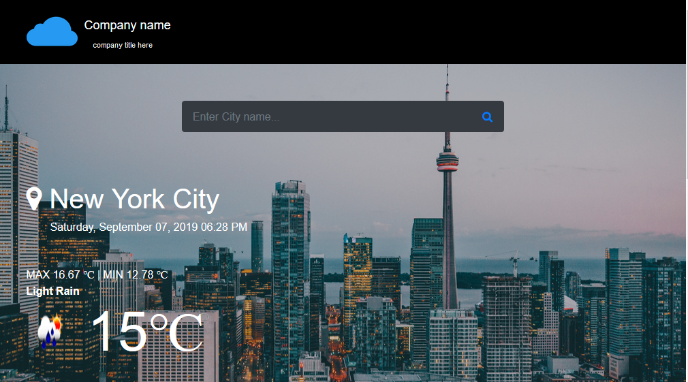
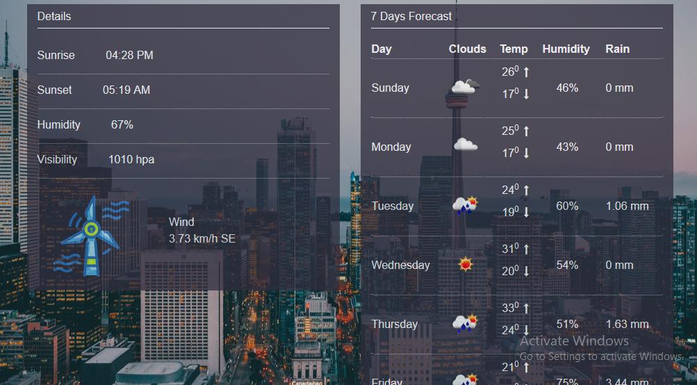

# weather-forecast-PHP

Using this website to know the current and next seven days of weather. I have used the API and mvc pattern in this project.


## Installation

* Install XAMPP or WAMPP
* open XAMPP Control panel and start [apache]
* Download project
* extract files in c:\xampp\htdocs
* Config base url BASE_URL and ASSETS_PATH (if needed) form: app/config/config.php
* Then open any browser and type: http://localhost/Weather-forecast-PHP/

## Configuration(if needed)

 If you any change folder name or structure please must be config folder path form app/config/config.php file.

		 	```
	<?php

		define('BASE_URL', 'http://localhost/Weather-forecast-PHP');
		define('ASSETS_PATH', 'http://localhost/Weather-forecast-PHP/public/');

	?>

		```


## Screenshots

 


 